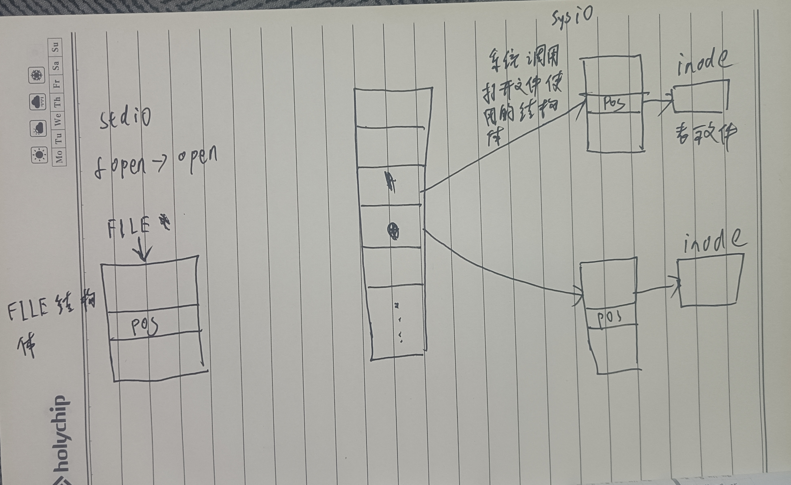

### apue

i/o：input & output，是一切实现的基础

- stdio 标准 io
- sysio 系统调用 io (文件 io)

如：要调用linux 内核要调用对应 linux 的系统调用 io，windows 的内核则调用对应的系统调用 io，所以不同的环境下系统调用 io 不同。

标准 io 是通过不同的系统调用 io 实现的，如 printf 是输出的函数，接口已经定义好，各系统调用 io 就按照这个实现出来，我直接调用标准 io 就可以实现，即统一了标准。

如果两种都可以使用的情况下，尽量选用标准 io，它移植性好，不管什么系统，都可以使用。

#### 标准 io

#### 文件 io (系统 io)

##### 文件描述符

文件描述符实际是一个整型数，数组下标，它优先使用当前可用范围内最小的。

如图所示，标准 io 打开文件时，是调用文件 io 的 open 打开的，文件 io 打开文件后，会有一个结构体描述文件的属性，然后指向这个结构体的指针存在一个数组中，标准 io 通过数组取操作文件，数组中存的是地址，所以是 int 型的，而标准 io 的文件描述符其实就是数组下标，通过操作数组下标来操作文件。

数组中一般默认有 1024 个空格，表示一个进程能打开的最大文件数。
