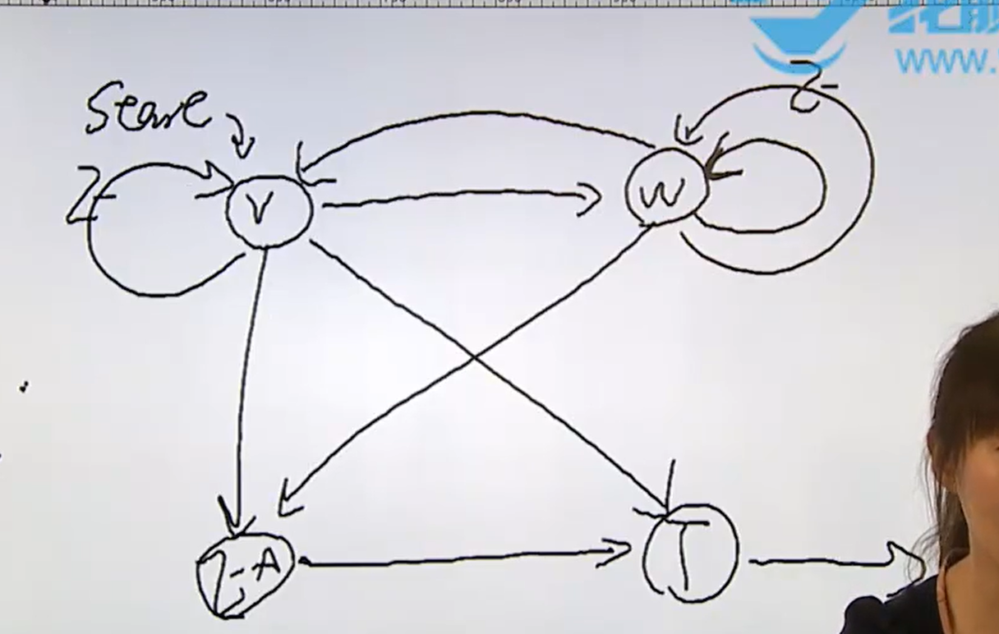

### 1. 非阻塞 IO -- 阻塞 IO

非阻塞（如信号打断等） read 返回报错 EAGAIN，是假错，阻塞（如没有内容读） read 返回报错 EINTR，也是假错。

#### 补充：有限状态机的编程思想

简单流程：自然流程是结构化的。

复杂流程：自然流程不是结构化的。

**例子**：数据中继实例，相当于 mycopy 的实现。状态机图如下：



程序在 1_IO/adv/nonblock/relay.c 中。

**中继引擎实例**：

上面的例子中是两个设备之间进行读和写，在这个的基础上我们来实现中继引擎，两个设备作为一个 JOB（两个设备为一组进行通信），最多可以支持一万个 JOB。

对于执行 drive 的函数采用单独扔出一个线程去执行，这个线程也是只能首次创建，后面的任务都不用再次创建线程，因为这一个线程每次都会遍历 JOB 数组，找到非空的任务，每一个任务中的两个状态机它都要去 drive 一下。具体程序在 adv/nonblock/relayer/ 中。

### 2. IO 多路转接（多路复用）

监视文件描述符的行为，当当前文件描述符发生了我感兴趣的行为的时候，我才去做后续操作。例如数据中继中忙等的那里，可以布置一个监视任务等到某时刻才 drive。

什么是IO多路复用？

举一个简单地网络服务器的例子，如果你的服务器需要和多个客户端保持连接，处理客户端的请求，属于多进程的并发问题，如果创建很多个进程来处理这些 IO 流，会导致 CPU 占有率很高。所以人们提出了 I/O 多路复用模型：**一个线程，通过记录 I/O 流的状态来同时管理多个 I/O**。

#### select 

古老，兼容性好，**以事件为单位，组织 fd** ，可移植。

select() 函数允许程序监视多个文件描述符，等待所监视的一个或者多个文件描述符变为“准备好”的状态。所谓的”准备好“状态是指：文件描述符不再是阻塞状态，可以用于某类 IO 操作了，包括可读，可写，发生异常三种。

select 工作原理：传入要监听的文件描述符集合（可读、可写或异常）开始监听，select 处于阻塞状态，当有事件发生或设置的等待时间 timeout 到了就会返回，返回之前自动去除集合中无事件发生的文件描述符，返回时传出有事件发生的文件描述符集合。但 select 传出的集合并没有告诉用户集合中包括哪几个就绪的文件描述符，需要用户后续进行遍历操作。

```C
// fd_set 表示文件描述符的集合，我们可以认为一个 fd_set 变量是由很多个二进制构成的数组，
// 每一位表示一个文件描述符是否需要监视。
int select(int nfds, fd_set *readfds, fd_set *writefds, 
		   fd_set *exceptfds, struct timeval *timeout);

// 从 set 集合中将 fd 删除
void FD_CLR(int fd, fd_set *set);   

// 判断 fd 是否在 set 中
int  FD_ISSET(int fd, fd_set *set); 

// 增加 fd 到 set 中
void FD_SET(int fd, fd_set *set);	

// 清空文件描述符集合
void FD_ZERO(fd_set *set);          

// nfds：监视对象文件描述符数量。
// readfds：监视文件描述符的一个集合，我们监视其中的文件描述符是不是可读，或者更准确的说，读取
// 是不是不阻塞了。
// writefds：监视文件描述符的一个集合，我们监视其中的文件描述符是不是可写，或者更准确的说，写
// 入是不是不阻塞了。
// exceptfds：异常的集合
// timeout ：超时设置，表示 select 返回之前的时间上限。如果这个参数不进行设置，一直阻塞，为死等。

// 这个函数指在 readfds 集合中有可以读的文件了，那么这个函数就会返回，或者在 writefds、
// exceptfds 中有写或者有异常了，那么这个函数都会返回，如果没有进行超时设置，那么直到感兴趣的
// 事情发生之前，这个函数都是死等的。函数返回了会返回到 readfds, writefds, excepts 这三个集合
// 当中，我们可以用 FD_ISSET 来判断某个文件描述符是否可读、可写、异常。
```

**注意**

nfds：是一个整数值， 表示集合中所有文件描述符的范围，即所有文件描述符的最大值 +1。在 windows 中不需要管这个。假如你要检测的描述符为 8， 9， 10， 那么系统实际也要监测 0， 1， 2， 3， 4， 5， 6,  7， 此时真正待测试的描述符的个数为 11个， 也就是 max（8， 9， 10） + 1。

使用案例：

```C
fd_set readfds;
int fd;
FD_ZERO(&readfds)//新定义的变量要清空一下。相当于初始化。
FD_SET(fd,&readfds);//把文件描述符 fd加入到 readfds中。

//判断是否成功监视
if (FD_ISSET(fd, &readset)) {
    //dosomething
}
```

```C
// 布置监视任务
FD_ZERO(&rset);
FD_ZERO(&wset);

if (fsm12.state == STATE_R) {
	// 这个状态机为读时，表示从 1 中读，要将文件描述符
	// 1 放进 rset 中
	FD_SET(fsm12.sfd, &rset);
}
if (fsm12.state == STATE_W) {
	FD_SET(fsm12.dfd, &wset);
}

if (fsm21.state == STATE_R) {
	FD_SET(fsm21.sfd, &rset);
}
if (fsm21.state == STATE_W) {
	FD_SET(fsm21.dfd, &wset);
}

// 监视
// 注意这里的 if 不能是 while (以前我们为了防止假错，会加上 while)，只能是 if
// 因为这个函数中监视现场和监视结果放在同一个空间，即这三个空间中，如果 select 被
// 一个信号打断发生了假错，那么它会先清空这三个集合，然后再将发生了时间的结果写进去，
// 显然，你设置的监视任务已经被清空，所以要想重新布置监视，只能重新设置。

// 只有读和写时才要监视，T 态和异常态不用，而是直接推。
if (fsm12.state < STATE_AUTO || fsm21.state < STATE_AUTO) {
	if (select(max(fd1, fd2) + 1, &rset, &wset, NULL, NULL) < 0) {
		if (errno == EINTR) {
			continue;
		}
		perror("select()");
		exit(1);
	}
}

// 查看监视结果
if (FD_ISSET(fsm12.sfd, &rset) || FD_ISSET(fsm12.dfd, &wset)
	|| fsm12.state > STATE_AUTO)
	fsm_driver(&fsm12);
if (FD_ISSET(fsm21.sfd, &rset) || FD_ISSET(fsm21.dfd, &wset)
	|| fsm21.state > STATE_AUTO)
	fsm_driver(&fsm21);
}

// 还原状态
fcntl(fd1, F_SETFL, fd1_save);
fcntl(fd2, F_SETFL, fd2_save);
```

使用 select，将 nfds 设为 -1， 集合都为空，设置 timeout，则可实现 sleep事件

缺点：

1. 监视现场和监视结果存放在同一空间。

2. nfds 的最大数有上限。

3. 以事件为单位，监听 fd，事件太单一，只有读、写，异常。

#### poll

**以 fd 为单位，组织事件** ，可移植。

```C
int poll(struct pollfd *fds, nfds_t nfds, int timeout);

// fds：结构体数组的起始地址，里面每个元素都是一个结构体

// nfds：结构体数组的长度，通过这个才知道数组的大小

// timeout：-1 阻塞，0 非阻塞，事件一发生就返回，正数表示毫秒超时

//自己建立的数组，通过将你要监视的文件描述符放进结构体中，然后再将结构体放到数组中。
//元素是 struct pollfd 类型。
struct pollfd {
   int   fd;         /* file descriptor */
   short events;     /* requested events */   //你所关心的事件
   short revents;    /* returned events */    //已经发生的事件
};

//成功返回的数字表示事件发生的个数，失败返回 -1，并设置 errno，假错 EINTR。

//events 是位图，添加要监听的事件时用 |，在 revents 中判断事件有无发生时用 & 方法。

// 那么怎么添加或者判断呢？poll 是以 fd 为单位添加事件的，所以不像 select 那样为 readfds 
// 那样来为这个事件添加文件描述符的集合，而是直接为某个 fd 添加事件，而且事件的类型也比较多。
// POLLIN   读
// POLLIN   写
// .......

// 比如要添加读事件：pfd[0].events |= POLLIN;
// 判断读事件有没有发生：pfd[0].revents & POLLIN

1. 监视现场和监视结果分别存放
2. 数组没有长度限制
3. 事件种类更多
```

#### epoll

**linux 的方言，优化 poll** ，不可移植。

```C
int epoll_create(int size);
// size 大于 0 以便兼容老的内核版本
// 成功返回 fd，失败返回 -1

// 控制 epoll 实例
int epoll_ctl(int epfd, int op, int fd, struct epoll_event *event);

int epoll_wait(int epfd, struct epoll_event *events,
				int maxevents, int timeout);

```

### 3. 其他读写函数

```C
ssize_t readv(int fd, const struct iovec *iov, int iovcnt);

struct iovec {
   void  *iov_base;    /* Starting address */
   size_t iov_len;     /* Number of bytes to transfer */
};
	   
writev()

//以上两个函数操作的空间可以不是连续的空间，第二个参数是一个存 struct iovec 类型的结构体首
//地址的数组，所以你可以把多片不连续的空间以结构体的形式放在这个数组中。一片一个结构体。
```

### 4. 存储映射 IO

将内存映射到进程地址空间。

```C
void *mmap(void *addr, size_t length, int prot, int flags,
			int fd, off_t offset);

// addr：指把映射的空间放到那里，可以为 NULL，自动找地址。
// length：映射长度
// prot：操作属性，读写等
// flags：必选（MAP_SHARED（共享）、MAP_PRIVATE（私有））。MAP_ANONYMOUS：匿名映射，相当于 // malloc，此时 fd 为 -1
// fd：要映射的文件，映射前要先打开。
// offset：偏移量，从文件的此处偏移量开始映射。

// 解除映射
// 返回值是映射的地址，失败返回 MAP_FAILED，且设置 errno。
int munmap(void *addr, size_t length);
// 匿名映射相当于 free
```

例题：

1. 求一个文件中字母 a 有多少个，在  /adv/mmap/mmap.c 。

2. 可以实现共享内存（mmap 和 sysV 都可实现共享内存，但 mmap 更快更方便），实现父子进程通信，先 mmap，然后再 fork()。在 /adv/mmap/shm.c 中。

### 5. 文件锁

多线程下载文件时，对文件的某块加锁

1. fcntl();

2. lockf();

示例程序再 /adv/lockf/add.c 中。

```C
int lockf(int fd, int cmd, off_t len);

// 对 fd 文件的 len 长度执行 cmd 操作。cmd 有 lock ulock tlock(trylock) test
```

3. flock();

在对文件加锁时，是加在 inode 上，而不是 fd 所对应的结构体上，使用 dup 或 dup2 使不同的 fd 对应同一个 fd 对应的结构体，此时关闭文件则两个 fd 都关闭。但对一个文件打开多次时，一个 fd 关闭，会意外释放在文件上加的文件锁。   
